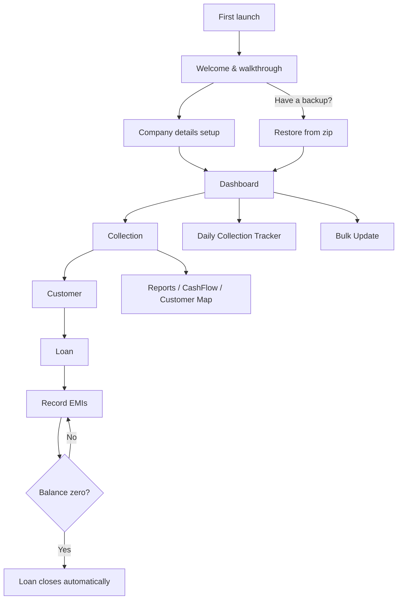

# VasoolBook — User Guide

**Simple loan manager for tracking EMIs & repayments**
Version 1.8.3 · This guide covers every feature of the app, how to use it, and the overall app flow.

---

## Table of Contents

1. [What is VasoolBook?](#1-what-is-vasoolbook)
2. [Core Concepts & App Flow](#2-core-concepts--app-flow)
3. [Getting Started](#3-getting-started)
4. [Dashboard](#4-dashboard)
5. [Collections](#5-collections)
6. [Customers](#6-customers)
7. [Loans](#7-loans)
8. [Collecting EMIs](#8-collecting-emis)
9. [Customer Map](#9-customer-map)
10. [CashFlow Book](#10-cashflow-book)
11. [Reports & Export](#11-reports--export)
12. [Receipts & Thermal Printing](#12-receipts--thermal-printing)
13. [Backup & Restore](#13-backup--restore)
14. [Security](#14-security)
15. [Settings & Preferences](#15-settings--preferences)
16. [Notifications](#16-notifications)
17. [Subscription Plans](#17-subscription-plans)
18. [Troubleshooting & FAQ](#18-troubleshooting--faq)

---

## 1. What is VasoolBook?

VasoolBook is a loan and collection management app for finance businesses and individual collection agents. It replaces the paper "vasool" notebook: you organise borrowers into **collections** (collection lines/routes), give **loans**, and record **EMI payments** as you collect them — with automatic balance tracking, due-date tracking, receipts, reports, and backups.

- Works fully offline; data is stored on your phone
- Available in 6 app languages: English, தமிழ், हिंदी, తెలుగు, ಕನ್ನಡ, മലയാളം
- Optional Google Drive backup keeps your data safe

---

## 2. Core Concepts & App Flow

| Term | Meaning |
|---|---|
| **Organization** | Your business — name, phone, logo, currency. Appears on receipts and PDFs. |
| **Collection** | A group/line of customers collected on the same cycle (e.g., "Market Street Daily"). Defines the type (daily/weekly/monthly…), interest rate, and default installment count. |
| **Customer** | A borrower inside a collection — name, phone, photo, address, GPS location. |
| **Loan** | Money given to a customer. The app calculates interest, total amount, EMI amount, and due dates from the collection settings. |
| **EMI / Installment** | One repayment. Recording it updates the repaid amount, balance, and next due date automatically. The loan closes itself when the balance reaches zero. |

### App flow

**A typical day with VasoolBook:** open the app → the Dashboard shows what's due and overdue → open the Daily Collection Tracker or a collection → collect and record EMIs door-to-door (the Customer Map can guide you) → share receipts by WhatsApp/SMS or print them → note the day's cash in the CashFlow Book → your Google Drive auto-backup runs daily.

---

## 3. Getting Started

### First launch

1. Open the app. You'll see the **Welcome** screen with a 3-page walkthrough (swipe to browse).
2. Options here:
   - **Watch App Demo** — opens a video tutorial (in Tamil) on YouTube.
   - **Let's get Started** — continues to company setup.
   - **Already have a backup? click here to Restore** — pick a VasoolBook backup `.zip` and all your data is restored.
3. On first launch the app also asks for **Notifications** and **Camera** permission (used for EMI reminders and customer photos).

### Company details (Organization setup)

*[Screenshot: Company Details screen]*

1. Add your **company logo** (optional) — picked from the gallery and cropped square. It appears on loan PDFs.
2. Enter **Company Name** (required) and **Phone Number** (required, exactly 10 digits).
3. Optionally add E-mail, Address, and **Terms and Conditions** (printed on loan PDFs).
4. Choose your **Currency** from the list.
5. Tap **Save Company Details**. You land on the Dashboard — setup is complete and won't be asked again.

You can edit company details anytime from **Settings → Company Details**.

---

## 4. Dashboard

*[Screenshot: Dashboard]*

The Dashboard is home base. From top to bottom:

- **Top bar** — your organization name, plus three buttons: **Contact Support**, **Plans/Upgrade**, and **Settings**.
- **Collection Alert widget** — appears when loans are overdue or due today ("N loans overdue"). Tap it to open the **Daily Collection Tracker**.
- **Gross Balance card** — total outstanding balance of all active loans, split by collection type with a proportional bar. The **Export** button here exports your data (Diamond plan).
- **All Collections (N)** — your collections list with a **sort menu** (Name A–Z / Z–A, Creation oldest/newest — remembered) and a **Bulk Update** shortcut (Diamond plan).
- **Search** — appears automatically once you have 5 or more collections; searches by collection name or area.
- **Collection cards** — name, area, active loan count, and outstanding balance. The corner badge shows the collection day (for weekly types) or the type. Tap to open the collection.
- **New Collection** button — creates a collection (Base plan allows up to 5; Premium/Diamond unlimited).

> **Privacy Mode:** when enabled (see [Security](#14-security)), all amounts on the Dashboard and trackers show as `* * * * *`.

---

## 5. Collections

A collection defines *how* a group of customers repays.

### Collection types

| Type | EMI cycle | Interest calculation | End date |
|---|---|---|---|
| **Daily** | Every day | `loan amount × rate ÷ 100` (flat, up-front) | start + installments (days) |
| **Weekly** | Every week (pick a collection day) | same as Daily | start + installments (weeks) |
| **Bi-Weekly** | Every 2 weeks (pick a day) | same as Daily | start + installments × 2 (weeks) |
| **Custom Weekly** | Every week (pick a day) | `rate × installments` (rate is the amount per 100 per installment) | start + installments (weeks) |
| **Monthly** | Every month | `rate × installments` | start + installments (months) |
| **Monthly (Interest)** | Every month | Interest-only EMIs: each EMI = the interest amount; the principal stays as the balance until settled | start + installments (months) |

> **Monthly (Interest)** collections require the Premium plan, and are not available in Bulk Update.

### Create a collection

1. Dashboard → **New Collection**.
2. Enter **Collection Name** and **Area Name**.
3. Pick the **Collection Type**; for weekly types also pick the **Collection Day** (Monday–Sunday).
4. Set the **Interest Rate (amount per 100)**, optional **Processing Fees**, whether to **Take Interest at Start** (interest deducted from the amount handed over), and the default **number of installments**.
5. Add **Notes** if needed and **Save**. New loans in this collection pre-fill these values (you can still change them per loan).

### Inside a collection

*[Screenshot: Collection Details screen]*

- **Header card** — today's summary, gross balance, an **eye button** to hide/show amounts (passcode-protected if Passcode Lock is on), and **View CashFlow** (Premium).
- **Top bar** — **Customer Map** button (Diamond), **Reports** button (Premium), and a **⋮ menu**: Edit Collection, Delete Collection, **Reorder Customers** (Diamond — drag customers into your door-to-door route order), Reports.
- **Tabs** — Active / Inactive / All customers.
- **Filter chips** (Active tab) — **All · n**, **Due Today · n**, **Overdue · n** with live counts. Tap to filter the list.
- **Sort** — the sort button offers Custom Order (your reorder), Name A–Z, Name Z–A. The choice is remembered per collection.
- **Search** — the magnifier expands a search box (always visible on Inactive/All tabs).
- **Customer cards** — photo, name, area, phone (tap the phone icon to call), loan amount, EMI, due date, and pending balance. A **+** button records an EMI directly from the list (Premium).
- **New Customer** button — Base plan allows 20 customers per collection; Premium/Diamond unlimited.

---

## 6. Customers

### Add a customer

1. Open a collection → **New Customer**.
2. Add a **photo** (camera or gallery, cropped) — optional.
3. Enter **Customer Name** (required), phone, e-mail, address.
   - Use the **import-from-contacts** button in the top bar to fill name/phone from your phonebook.
4. **Customer Location** — tap the field to open the **map picker**:
   - Pan the map under the red center pin, or
   - **Search** a city/area/landmark, or
   - Tap the **my-location** button to jump to where you're standing (asks location permission once).
   - Tap **Confirm Location**. The coordinates appear in the field; ✕ clears them.
5. **SMS notifications** toggle — when on (and a phone number exists), the app offers WhatsApp/SMS receipts after loans and EMIs.
6. **Save Customer Details**.

### Customer details screen

*[Screenshot: Customer Details]*

- Profile card: photo, name, phone, address, and **Navigate to customer location** *(Diamond)* — opens turn-by-turn directions in your maps app when a location is saved.
- Loan overview for the active loan: progress bar, Total/Paid/Balance tiles, EMI amount and next due date, repayment history, and the **Repayment Schedule**.
- Top bar: **share** and **download** the loan statement PDF (Premium), and a **⋮ menu**: Edit Customer, **Edit Loan**, Delete Customer, Delete Loan.
- **Add EMI** button at the bottom records a payment.
- Customers with no active loan show **New Loan** instead.

---

## 7. Loans

### Create a loan

1. Customer details → **New Loan**.
2. The form pre-fills from the collection (interest rate, installments, charges). Enter the **Loan Amount** and adjust anything needed, including the start date.
3. Tap **Calculate** to preview: amount given, total interest, total to repay, EMI amount, and the end date.
4. **Save**. If the customer has a phone number and SMS enabled, a **Send Receipt** sheet offers WhatsApp / SMS / Print.

The math in brief: interest is computed per the collection type (see the table in [Collections](#5-collections)); if "interest at start" is on, the interest is deducted from the cash handed over; EMI = total ÷ installments.

### Manage a loan

- **Edit Loan** (⋮ menu on customer details) — change amounts/rate/installments; recalculates while **preserving the repaid amount and current due date**. The app blocks a new total lower than what's already repaid.
- **Close Loan** — mark it settled manually (it also closes automatically at zero balance).
- **Closed loans** — every customer's past loans are listed under View Closed Loans, with PDF share/download (Premium).
- **Repayment Schedule** — full installment table; share it as a PDF from the top bar.

---

## 8. Collecting EMIs

You can record a payment four ways:

### a) From the customer screen
Customer details → **Add EMI** → date (defaults to today), amount (capped at the balance), and Cash/**Online** payment mode → Save. Balance, repaid amount, and the next due date update automatically; the loan closes at zero balance. A receipt sheet follows (if the customer has SMS enabled).

### b) Quick-pay from the collection list *(Premium)*
Tap the **+** on a customer card in the collection list — same EMI sheet without leaving the list.

### c) Daily Collection Tracker
Dashboard alert widget or **Settings → Daily Collection Tracker**.

*[Screenshot: Today's Collection screen]*

- **Collected vs Target** progress for today.
- **Overdue EMIs** (red) and **Today's Due EMIs** lists — each row shows the customer, collection, EMI amount, and due date with a **Collect** button that opens the EMI sheet.

### d) Bulk Update *(Diamond)*
Dashboard → **Bulk Update** chip:

1. Pick the **date** (top bar) and the **collection** (Monthly-Interest collections are excluded).
2. Every active loan is listed with a pre-filled EMI amount (toggle **Pre-fill EMI Amount** in the ⋮ menu). Adjust amounts, choose Cash/Online per row, and select customers individually or with **Select All**.
3. The bottom bar totals your selection — tap **Update Entries** → confirm. All installments are saved in one shot.

---

## 9. Customer Map *(Diamond)*

*[Screenshot: Customer Map with pins]*

Open a collection → the **location icon** in the top bar.

- Every customer with a saved location appears as a **red pin with their name** on an OpenStreetMap view.
- The map auto-frames all pins; the **⛶ button** re-frames anytime. The bottom chip counts customers on the map.
- **Tap a pin** → a card with the customer's name, **current balance**, and **Open in Maps** (shows the spot in your maps app). Tap elsewhere to dismiss.
- Use it to plan routes and see your collection line geographically. (Requires internet for map tiles; viewed areas are cached.)

---

## 10. CashFlow Book *(Premium)*

Track daily cash movement per collection: collection details → **View CashFlow** → **Add Book Entry**.

*[Screenshot: CashFlow entry screen]*

1. Pick the **date** with the date selector card.
2. Enter **Incoming** (opening balance, cash in, collection amount, interest earned, other) and **Outgoing** (loan deposits, petrol, food, vehicle, other) amounts. The summary card shows Opening / Incoming / Outgoing / Closing live.
3. Review **Total Income / Total Expense** and the **Closing Balance**.
4. Add an optional **note** and Save.

Entries are listed by date with income, expense, opening/closing balances, and your note. Swipe right to edit, left to delete.

---

## 11. Reports & Export

### Collection reports *(Premium for PDF download; opens from collection details → Reports)*

*[Screenshot: Monthly report calendar]*

- **Monthly / Weekly toggle** in the top bar; arrows step between months/weeks.
- The **calendar** marks days that had new loans or collections. **Tap a day** for a Day Summary sheet: totals plus the day's loans and installments lists, with a per-day PDF download.
- Below the calendar: the period's **summary** (new investments, interest, total loans, total collection, counts) and the full **New Loans** and **Installments** lists.
- The **download button** exports the month/week report as a PDF (Premium).

### Advanced Reports *(Diamond)* — Settings → Advanced Reports: deeper business analytics.

### Export to Excel/CSV *(Diamond)*
Dashboard → **Export** on the Gross Balance card. Export **all collections** at once or any single collection. Produces a spreadsheet-compatible **CSV** file (customer, address, phone, loan given, interest, total, EMI, balance) saved to `Documents/VasoolBook/Export` and opened automatically.

---

## 12. Receipts & Thermal Printing

### WhatsApp / SMS receipts
After creating a loan or recording an EMI (for customers with a phone number and SMS enabled), the **Send Receipt** sheet offers:
- **WhatsApp** — opens a pre-written receipt message to the customer's number.
- **SMS** — same message via your SMS app.
- The receipt text follows your **SMS language** setting (e.g., Tamil).

### Thermal printer (Bluetooth ESC/POS)
1. **Settings → Thermal printer** → turn **Enable Thermal Printer** on.
2. Grant Bluetooth permission, pair your printer in Android Bluetooth settings, then tap **Connect** next to it in the paired devices list. Use **Test Print** to verify.
3. Once enabled *and connected*, a **Print Receipt** option appears in the Send Receipt sheet after loans and EMIs.

---

## 13. Backup & Restore

Your data lives on the phone — take backups seriously.

### Manual backup *(Premium)* — Settings → BackUp & Restore
- **Download Backup** — save a full backup `.zip` anywhere on your phone.
- **Restore BackUp Data** — pick a backup `.zip` to restore everything.
- **Backup & Share** — create a backup and share it (WhatsApp, email, Drive…).
- **Backup to Google Drive** — see below.

### Google Drive backup
- **Connect Google Drive** with your Google account, then **Backup now** anytime.
- **Enable Auto Backup** *(Diamond)* — backs up to your Drive **automatically once a day** (needs internet; first backup runs immediately when you enable it).

### Restoring on a new phone
Install VasoolBook → on the Welcome screen tap **"Already have a backup? click here to Restore"** → pick your `.zip`. Everything (collections, customers, loans, history) comes back.

---

## 14. Security

All under **Settings** and **Settings → User Preferences**:

- **Biometric Lock** (Settings → Security) — require fingerprint/face (or device PIN) every time the app opens.
- **Passcode Lock** (User Preferences → Security) — set a private 4-digit passcode. Once enabled, the passcode is required to:
  - turn Biometric Lock on/off,
  - toggle **Privacy Mode** (including the eye button inside collections),
  - disable or **change** the passcode itself (Change Passcode row appears once enabled).
- **Privacy Mode** — masks every amount in the app as `* * * * *`. Perfect when someone looks over your shoulder; flip it (with passcode, if set) to see real numbers.

> Forgot your passcode? Contact support from **Settings → Contact Support** — they can help you regain access.

---

## 15. Settings & Preferences

**Settings** (gear icon on the Dashboard):

| Item | What it does |
|---|---|
| Company Details | Edit organization info, logo, currency, T&C |
| Upgrade Subscriptions | Plans & payment (see [Plans](#17-subscription-plans)) |
| Analytics | Business analytics overview |
| Advanced Reports *(Diamond)* | In-depth reports |
| Daily Collection Tracker | Today's due/overdue collection list |
| User Preferences | See below |
| Thermal printer | Printer setup ([details](#12-receipts--thermal-printing)) |
| Biometric Lock | App lock toggle |
| BackUp & Restore *(Premium)* | Local & Drive backups |
| Contact Support / Rate / Review / Suggest a Feature / Refer & Earn | Support and feedback |
| Terms of Service / Privacy Policy | Legal documents |

**User Preferences:**

| Item | What it does |
|---|---|
| App Language | English, Tamil, Hindi, Telugu, Kannada, Malayalam — applies instantly |
| Theme | System / Light / Dark |
| Currency | Currency symbol used across the app |
| Privacy Mode | Mask all amounts |
| EMI Reminder Notifications | Daily reminder at 9:00 AM ([details](#16-notifications)) |
| Show EMI date with time | Repayment history shows the exact recorded time |
| Passcode Lock / Change Passcode | 4-digit protection ([details](#14-security)) |

---

## 16. Notifications

Enable **EMI Reminder Notifications** in User Preferences. Every day at **9:00 AM** the app checks your loans and notifies you only when there's something to collect:

- *"N EMI(s) due today • M overdue loan(s) pending"*
- *"Overdue EMI Alert — N loan(s) have overdue payments. Tap to review."*

Tapping the notification opens the app. Make sure notification permission is granted (asked at first launch; otherwise enable it in Android settings).

After app updates, a **What's New** dialog lists the latest features once per version.

---

## 17. Subscription Plans

| Feature | Base | Premium | Diamond |
|---|:---:|:---:|:---:|
| Collections | up to 5 | Unlimited | Unlimited |
| Customers per collection | up to 20 | Unlimited | Unlimited |
| Loans, EMI recording, daily tracker | ✅ | ✅ | ✅ |
| Loan PDF download, closed loans | ✅ | ✅ | ✅ |
| Monthly (Interest) collection type | — | ✅ | ✅ |
| Quick-pay EMI from customer list | — | ✅ | ✅ |
| Share loan PDF / company logo on PDF | — | ✅ | ✅ |
| Monthly & weekly reports + PDFs | — | ✅ | ✅ |
| CashFlow Book | — | ✅ | ✅ |
| Manual Backup & Restore | — | ✅ | ✅ |
| Bulk EMI Update | — | — | ✅ |
| Export to Excel/CSV | — | — | ✅ |
| Reorder customers (route order) | — | — | ✅ |
| Daily automatic Google Drive backup | — | — | ✅ |
| Customer Map & navigate to location¹ | — | — | ✅ |
| Advanced Reports | — | — | ✅ |
| Priority support | — | — | ✅ |

**How to upgrade** — Dashboard → plans icon, or Settings → Upgrade Subscriptions:
- **Google Play** — instant, secure in-app purchase.
- **Offline plans** — discounted yearly/monthly/trial plans activated by an emailed code (email support for the code, enter it on the activation screen).
- **UPI** — scan the QR / copy the UPI ID, pay, and share the screenshot with support; activation within 24 hours.
- **Refer & Earn** — share your referral link; earn Rs.100 per successful referral.

---

## 18. Troubleshooting & FAQ

**The map is blank / pins don't load.**
Map tiles need internet the first time. Check your connection; previously viewed areas work offline.

**"Use current location" fails.**
Grant location permission, turn GPS on, and try in an open area. Indoors the app falls back to your last known location.

**Auto-backup isn't running.**
It requires the Diamond plan, a connected Google Drive account, the toggle enabled, and internet. Backups run once per day.

**The print option doesn't appear after saving a loan/EMI.**
Thermal printing must be **enabled** in Settings → Thermal printer *and* a printer must be currently connected. Also, the receipt sheet only appears for customers with a phone number and SMS notifications enabled.

**I can't turn Privacy Mode / Biometric Lock off.**
Passcode Lock is on — enter your 4-digit passcode. Forgot it? Contact support.

**A customer paid more than the EMI / paid early.**
Enter any amount up to the balance when adding an EMI — the schedule and due date adjust automatically.

**I edited a loan — what happens to old payments?**
Nothing. Recorded installments are preserved; the app recalculates the balance as new total − already repaid, and blocks totals lower than the repaid amount.

**How do I move to a new phone?**
Old phone: Settings → BackUp & Restore → Download Backup (or Backup & Share). New phone: install → Welcome screen → Restore → pick the `.zip`.

**Something else?**
Settings → **Contact Support** — email (reply within 24 hours), WhatsApp group, and a Tamil demo video.

---

¹ *Saving* a customer's location (the map picker on the customer form) is available on every plan; *viewing* locations — the Customer Map and the navigate shortcut — requires Diamond.

*This guide describes VasoolBook v1.8.3. Some features require the Premium or Diamond plan as marked.*
